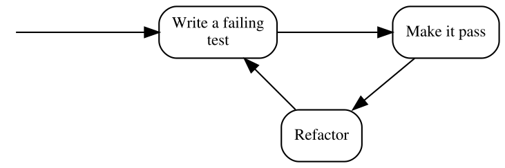
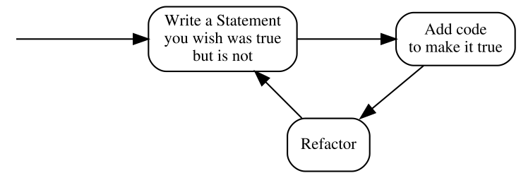

# Programowanie poprzedzone wymaganiem (Wymaganie-najpierw)

## Po co pisać specyfikację po fakcie?

Jedną z najbardziej znanych rzeczy na temat TDD jest to, że piszemy nieprzechodzący test, zanim w ogóle zaimplementujemy w kodzie potrzebne zachowanie. Ta koncepcja jest często nazywana "test-first development" i  dla wielu osób wydaje się być dość kontrowersyjna.

W poprzednim rozdziale powiedziałem, że w TDD "test" przyjmuje dodatkową rolę -- wymagania, które jest częścią specyfikacji. Jeśli tak postawimy sprawę, cała kontrowersyjna koncepcja "pisania testu przed kodem" wcale nie stanowi problemu. Wręcz przeciwnie -- wydaje się naturalne, aby sprecyzować, czego oczekujemy od kodu, zanim spróbujemy go napisać. Czy odwrotnie też to ma sens? Specyfikacja napisana po zakończeniu implementacji jest niczym więcej jak próbą udokumentowania istniejącego rozwiązania. Oczywiście, takie próby mogą stanowić jakąś wartość, gdy są wykonywane jako rodzaj inżynierii wstecznej (tj. gdy dokumentujemy istniejące rozwiązanie, albo zapisujemy specyfikację dla czegoś, co zostało zaimplementowane dawno temu i dla czego odkrywamy wcześniej niejawne reguły biznesowe). Pisanie specyfikacji ma w sobie coś z ekscytującego odkrywania, ale po tym, jak sami podjęliśmy wszystkie decyzje, nie wydaje mi się, aby był to produktywny sposób spędzania czasu. Nie wspominając o tym, że uważam to za nudne (możesz sprawdzić na własnej skórze, czy jesteś w stanie się ze mną zgodzić - spróbuj stworzyć prostą aplikację - kalkulator, a następnie napisz jej specyfikację zaraz po implementacji i ręcznym sprawdzeniu, czy działa). W każdym razie trudno mi doszukiwać się, jak coś powinno działać po tym jak to już zostanie stworzone. Może właśnie dlatego przez te lata zdążyłem zauważyć, że specyfikacje napisane "po" - są znacznie mniej kompletne niż te napisane przed wdrożeniem produktu.

Aha, i czy mówiłem wam, że bez jakiejkolwiek specyfikacji, nie wiemy, czy skończyliśmy wprowadzać zmiany do kodu, czy nie? Dzieje się tak, ponieważ aby ustalić, czy zmiana jest kompletna, musimy z "czymś" porównać zaimplementowaną funkcjonalność, nawet jeśli to "coś" znajduje się tylko w głowie klienta. w TDD "porównujemy" funkcjonalność z oczekiwaniami zaszytymi w zestawie automatycznych testów.

Inną rzeczą, o której wspomniałem w poprzednim rozdziale jest to, że zabieramy się za pisanie Specyfikacji za pomocą uruchamialnych Wymagań (Specification Statement) zupełnie inaczej niż gdy implementujemy, krok pro kroku, wygląd i działanie aplikacji korzystając z opisu, lub - chociażby - mamy z góry narzucone biznesowe wymagania (Requirements). W TDD, nawet jeśli zachowanie jest implementowane po tym, jak już istnieje koncepcja działania aplikacji, nie piszemy Specyfikacji tak, jakbyśmy mieli tekst przed oczyma i przekładali go na kod jota w jotę.
Zazwyczaj postępujemy tak, że napiszemy trochę Specyfikacji, a potem trochę kodu aplikacji i tak w kółko. W TDD przechodzimy wielokrotnie przez kilka faz, które składają się na cykl. Chcemy by te cykle były krótkie, abyśmy otrzymywali informacje zwrotne często i odpowiednio wcześnie. Informacje te są niezbędne, ponieważ pozwalają nam iść do przodu, dając pewność, że to co już mamy, działa zgodnie z naszymi zamierzeniami. Pozwalają nam również na usprawnienie następnego cyklu, dzięki wiedzy zdobytej w poprzednim cyklu (jeśli nie wierzysz, że liczy się szybka reakcja, zadaj sobie pytanie: "ile razy dziennie kompiluję kod, nad którym pracuję?").

Przeczytawszy tyle o cyklach, nie będzie dla Ciebie pewnie zaskoczeniem, że tradycyjna ilustracja procesu TDD jest wizualnie modelowana jako przepływ cykliczny:




Zwróć uwagę, że powyższy ilustarcja wykorzystuje tradycyjną terminologię TDD, więc zanim wyjaśnię kroki, oto podobna ilustracja, która korzysta z naszych pojęć Specyfikacji (Specifiction) i Wymagania (Statement): 



1. Napisz Wymaganie, które chciałbyś, by było spełnione ale nie jest. 
2. Dodaj kod, by Wymaganie zostało spełnione. 
3. Zrefaktoruj kod.

Druga wersja wydaje się mieć bardziej sens niż pierwsza - określenie, jak coś powinno się zachowywać przed napisaniem kodu dla tego zachowania, jest bardziej intuicyjne niźli "testowaniu" czegoś, co jeszcze nie istnieje.

W każdym razie te trzy kroki zasługują na wyjaśnienie. W następnych rozdziałach podam kilka przykładów na to, jak proces ten działa w praktyce i wprowadzę rozszerzoną wersję, ale w międzyczasie wystarczy wyjaśnić, że:

Napisz Wymaganie, które chciałbyś, by było spełnione ale nie jest.
:   oznacza, że Wymaganie jest niespełnione i na liście testów pojawia się to jako błąd, fiasko (fail), który większość frameworków xUnit zaznacza kolorem czerwonym.

Dodaj kod, by Wymganie zostało spełnione.
:    oznacza, że piszemy tylko tyle kodu, aby Wymaganie było spelnione, nie więcej. Na liście testów takie Wymaganie jawi się jako sukces (pass), które większość frameworków xUnit zaznacza kolorem zielonym. W dalszej części książki zobaczysz, jak mało może oznaczać "wystarczająco dużo".

Zrefaktoruj kod.
:   jest krokiem, który do tej pory milcząco ignorowałem i zrobię to jeszcze przez kilka kolejnych rozdziałów. Nie martw się, w końcu wrócimy do tego. Na razie ważne jest, aby mieć świadomość, że Wykonywalna Specyfikacja może działać jak siatka zabezpieczając w cyrku. Podczas gdy my *poprawiamy jakość kodu bez zmiany jego zachowania zewnętrznego*, dzięki częstemu wykonywaniu kodu Specyfikacji, szybko odkrywamy każdy błąd, który popełniliśmy w procesie refaktorzacji.

Nawiasem mówiąc, proces ten jest czasami określany jako "Red-Green-Refactor", ze względu na kolory wyświetlane przez narzędzia xUnit w przypadku niepowodzenia i sukcesu testu. Tylko o tym tutaj wspominam -- nie będę używał tego terminu w dalszej części książki.

## "Najpierw-test" oznacza patrzenie na niepowodzenie

Wyjaśniając powyższy rysunek opisujący TDD, zwróciłem uwagę, że powinniśmy napisać Wymaganie, które chcielibyśmy, by było spełnione **ale nie jest**. Oznacza to, że nie tylko trzeba napisać Wymaganie przed implementacją, dzięki której wymaganie jest spełnione, ale musimy również to Wymaganie ewaluować (tj. uruchomić) i obserwować, że - w istocie - nie spełnia swoich założeń przed dostarczeniem implementacji.

Dlaczego to takie ważne? Czy nie wystarczy samo zapisanie Wymagania? Przecież wiadomo, że nie jest spełnione, gdy nie ma odpowiedniego kodu - po co je uruchamiać i oglądać jak świeci na czerwono na liście? Jest kilka powodów i postaram się pokrótce omówić kilka z nich.

Głównym powodem sprawdzenia, czy Wymaganie nie jest spełnione jest fakt, iż nie ma żadnego dowodu na to, że napisane Wymaganie skończy się kiedykolwiek spektakularnym fiaskiem po uruchomieniu.

Każde dobrze napisane Wymaganie nigdy nie przechodzi sprawdzenia, gdy nie jest spełnione, a zawsze przechodzi sprawdzenie, gdy jest spełnione. Jest to jeden z głównych powodów, dla których je piszemy - chcemy zobaczyć przejście od *Red* (czerwonego) do *Green* (zielonego), co oznacza, że ​​to, co wcześniej nie zostało zaimplementowane nie działało (i mieliśmy na to dowód), a teraz działa (i również mamy na to dowód). Obserwacja przejścia Red-Green pokazuje, że ​​zrobiliśmy postęp.

Inną rzeczą, na którą należy zwrócić uwagę, jest to, że napisanie kodu, który spełnia Wymaganie, sprawia iż staje się ono częścią uruchamialnej Specyfikacji. Gdy, choć przez chwilę, kod przestaje spełniać Wymaganie dowiadujemy się o tym (to może być na przykład wynik pomyłki podczas refaktoryzacji kodu).

Zauważenie, że Wymaganie nie jest spełnione dostarcza nam cennych informacji. Jeśli uruchomimy je wyłącznie *po* napisaniu kodu dla opisywanego zachowania, to skąd wiemy, że Wymaganie weryfikuje nasze prawdziwe oczekiwania i potrzeby? Nigdy nie widzieliśmy, by Wymaganie kiedykolwiek świeciło na czerwono, więc jaki mamy dowód, że w ogóle jest w stanie powiadomić nas o fiasku?

Pierwszy raz spotkałem się z tym argumentem, tuż przed tym, gdy zacząłem myśleć o testach jak o uruchamialnej specyfikacji. "Poważnie?" -- pomyślałem -- "Wiem doskonale, co koduje, jeśli zrobię wystarczająco małe testy, będzie oczywiste, że opisują prawidłowe zachowania. To jest zwykła paranoja". Jednak życie szybko zweryfikowało moje założenia i byłem zmuszony wycofać się ze swoich poglądów. Pozwolę sobie opisać trzy sposoby na to, jak napisać Wymaganie, które nigdy nie świeci na czerwono, niezależnie od tego, czy kod jest poprawny czy też nie. Tych sposobów jest więcej, ale myślę, że danie wam trzech powinno być wystarczającą ilustracją.

Oto sytuacje, kiedy odnosiłem wrażenie, że Wymaganie jest spełnione, nawet jeśli nie było:

### 1. Omyłkowe nieoznaczenie Wymagania w Specyfikacji

Zazwyczaj nie wystarczy napisanie kodu Wymagania - musimy także poinformować proces uruchamiający testy, że metoda, którą napisaliśmy, jest faktycznie Wymaganiem (a nie np. jakąś metodą pomocniczą) i musi zostać uruchomiona przez ten proces.

Większość frameworków typu xUnit ma jakiś mechanizm oznaczania metod jako Wymaganie, czy to przy użyciu atrybutów (C #, np. `[Fact]`) czy adnotacji (Java, np. `@ Test`), lub przy użyciu makr (C i C ++), lub przy użyciu konwencji nazewniczej. Musimy użyć takiego mechanizmu, aby proces uruchamiający testy wiedział, że powinien wykonywać takie metody.

Weźmy na przykład xUnit.Net. Aby przekształcić zwykłą metodę w Wymaganie, musimy oznaczyć ją za pomocą atrybutu `[Fact]`:

```csharp
public class CalculatorSpecification
{
  [Fact]
  public void ShouldDisplayAdditionResultAsSumOfArguments()
  {
    //...
  }
}
```

Jest szansa, że zapomnimy oznaczyć metodę atrybutem `[Fact]` - w takim przypadku ta metoda nigdy nie będzie wykonywana przez proces uruchamiający testy. Choć może to zabrzmieć zabawnie, kilka razy mi się to przydarzyło. Wyobrażmy sobie, że powyższe Wymaganie piszemy post-factum jako test jednostkowy w środowisku, które ma, powiedzmy, ponad trzydzieści innych Wymagań już napisanych i spełnianych podczas uruchamiania. Napisaliśmy wcześniej kod dla naszych zachowań, a teraz dodajemy test po teście, aby upewnić się, że kod działa. Pierwszy test -- sukces, drugi test -- sukces, trzeci test -- suckes... świetnie! Co ciekawe, kiedy wykonuję testy, prawie zawsze uruchamiam więcej niż jeden naraz (*służy do tego specjalny przycisk*), ponieważ jest to dla mnie łatwiejsze niż każdorazowe wybieranie z listy tego, co chcę aktualnie ewaluować. Poza tym, uruchamiając wszystkie testy, zyskuję więcej pewności, że nie popełniłem błędu i nie zepsułem czegoś, co było napisane wcześniej. Tu się pojawia problem, bo nawet jeśli każę uruchomić wszystkie testy i wszystkie przejdą, to te oznaczone nieprawidłwo nigdy nie zostaną uruchomione.

Z biegiem czasu nauczyłem się używać mechanizmu code snippets (*wstawianie szablonów kodu w edytorze*) w moim IDE do generowania szkieletu Wymagań. Wcześniej zdarzało mi się jednak pisać coś takiego:


```csharp
public class CalculatorSpecification
{
  //... jakieś inne Wymagania

  //uups...zapomniałem wstawić atrybutu!
  public void ShouldDisplayZeroWhenResetIsPerformed()
  {
    //...
  }
}
```

Jak widzisz, brakowało atrybutu `[Fact]`, czyli Wymaganie nie było uruchamiane. Nawet nie dlatego, że nie umiałem korzystać z generatorów kodu - po prostu w celu utworzenia nowego Wymagania wygodniejsze było dla mnie skopiowanie i wklejenie innego Wymagania, zmiana jego nazwy i kilku linii jego kodu [^ copypaste]. Nie zawsze pamiętałem, aby dołączyć atrybut `[Fact]` w skopiowanym kodzie źródłowym. Kompilator też nie narzekał.

Powodem, dla którego nie potrafiłem dostrzec swojego błędu był fakt, że uruchamiałem cały czas wszystkie testy jednocześnie - i kiedy pojawił się zielony pasek (który oznacza, że wszystkie Wymagania są spełnione), założyłem, że nowonapisane Wymaganie również jest spełnione. Nie jest rzeczą fajną sprawdzanie, że każde nowe Wymaganie faktycznie pojawia się na liście Wymagań, więc tego nie robiłem. Co gorsza - brak atrybutu `[Fact]` nie zakłócał mojej pracy: pisałem test -- wszystkie testy przeszły, pisałem kolejny test -- wszystkie testy przeszły, kolejny test - wszystkie przeszły... Innymi słowy, mój sposób pracy nie dawał żadnej informacji zwrotnej, że popełniłem gdzieś, jakiś błąd. Tak więc, w tym przypadku, nie chodziło o to, że Wymaganie może nie być spełnione, bo jest źle napisane, ale o to, że **ono w ogóle nie zostało uruchomione i nie podlegało żadnej ewaluacji**.

W jaki sposób może pomóc postrzeganie testów jako Wymagań i uruchamianie ich przed napisaniem kodu dla konkretnego zachowania? W TDD normalny schemat wytawarzania programowania to: test - fiasko - sukces, test - fiasko - sukces, test - fiasko - sukces...  To podstawową różnica. Innymi słowy spodziewamy się, że podczas pracy w TDD, dowolne Wymaganie jest niespełnione conajmniej raz i sprawdzamy to. Tak więc za każdym razem, gdy nowy test nie kończy się "niepowodzeniem", otrzymujemy informację zwrotną że dzieje się coś mocno podejrzanego. To pozwala nam zacząć badać sprawę i rozwiązać problem.

### 2. Inicjalizacje umieszczone w złej kolejności

Dobrze, to może się wydawać jeszcze bardziej zabawne, ale zdarzyło mi się to kilka razy i zakładam, że pewnego dnia Tobie też może się przydarzyć, zwłaszcza jeśli się spieszysz.

Rozważmy następujący przykładzik: chcemy zweryfikować prostą strukturę danych, która odzwierciedla ramkę danych, które mogą dotrzeć przez sieć. Struktura wygląda następująco:

```csharp
public class Frame /* ramka */
{
  public int timeSlot; /* przedział czasu */
}
```

and we need to write a Specification for a `Validation` class that accepts a `Frame` as an argument and checks whether the time slot (whatever it is) is above a value specified in a constant called `TimeSlot.MaxAllowed` (so it's a constant defined in a `TimeSlot` class). If it is, then the validation returns `false`, if it's not, then it returns `true`.

Let's take a look at the following Statement which specifies that setting a value higher than allowed to a field of a `frame` should make the validation fail:

```csharp
[Fact]
public void ShouldRecognizeTimeSlotAboveMaximumAllowedAsInvalid()
{
  var frame = new Frame();
  var validation = new Validation();
  var timeSlotAboveMaximumAllowed = TimeSlot.MaxAllowed + 1;
  var result = validation.PerformForTimeSlotIn(frame);
  frame.timeSlot = timeSlotAboveMaximumAllowed;
  Assert.False(result);
}
```

Note how the method `PerformForTimeSlotIn()`, which triggers the specified behavior, is accidentally called *before* a value of `timeSlotAboveMaximumAllowed` is set up and thus, this value is not taken into account at the moment when the validation is executed. If, for example, we make a mistake in the implementation of the `Validation` class so that it returns `false` for values below the maximum and not above, such mistake may go unnoticed, because the Statement will always be true.

Again, this is a toy example - I just used it as an illustration of something that can happen when dealing with more complex cases.

### 3. Używanie danych typu static wewnątrz kodu produkcyjnego

Once in a while, we have to jump in and add some new Statements to an existing Specification and some logic to the class it describes. Let's assume that the class and its Specification were written by someone else than us. Imagine the code we are talking about is a wrapper around our product XML configuration file. We decide to write our Statements *after* applying the changes ("well", we may say, "we're all protected by the Specification that is already in place, so we can make our change without the risk of accidentally breaking existing functionality, and then just test our changes and it's all good...").

We start coding... done. Now we start writing this new Statement that describes the functionality we just added. After examining the Specification class, we can see that it has a member field like this:

```csharp
public class XmlConfigurationSpecification
{
  XmlConfiguration config = new XmlConfiguration(xmlFixtureString);
  
  //...
```

What it does is it sets up an object used by every Statement. So, each Statement uses a `config` object initialized with the same `xmlConfiguration` string value. Another quick examination leads us to discovering the following content of the `xmlFixtureString`:


```xml
<config>
  <section name="General Settings">
    <subsection name="Network Related">
      <parameter name="IP">192.168.3.2</parameter>
      <parameter name="Port">9000</parameter>
      <parameter name="Protocol">AHJ-112</parameter>
    </subsection>
      <subsection name="User Related">
      <parameter name="login">Johnny</parameter>
      <parameter name="Role">Admin</parameter>
      <parameter name="Password Expiry (days)">30</parameter>
    /subsection>
    <!-- and so on and on and on...-->
  </section>
</config>
```

 The string is already pretty large and messy, since it contains all information that is required by the existing Statements. Let's assume we need to write tests for a little corner case that does not need all this crap inside this string. So, we decide to start afresh and create a separate object of the `XmlConfiguration` class with your own, minimal string. Our Statement begins like this:

```csharp
string customFixture = CreateMyOwnFixtureForThisTestOnly();
var configuration = new XmlConfiguration(customFixture);
...
```

And goes on with the scenario. When we execute it, it passes -- cool... not. Ok, what's wrong with this? At the first sight, everything's OK, until we read the source code of XmlConfiguration class carefully. Inside, we can see, how the XML string is stored:

```csharp
private static string xmlText; //note the static keyword!
```

It's a static field, which means that its value is retained between instances. What the...? Well, well, here's what happened: the author of this class applied a small optimization. He thought: "In this app, the configuration is only modified by members of the support staff and to do it, they have to shut down the system, so, there is no need to read the XML file every time an XmlConfiguration object is created. I can save some CPU cycles and I/O operations by reading it only once when the first object is created. Later objects will just use the same XML!". Good for him, not so good for us. Why? Because, depending on the order in which the Statements are evaluated, either the original XML string will be used for all Statements or your custom one! Thus the Statements in this Specification may pass or fail for the wrong reason - because they accidentally use the wrong XML. 

Starting development from a Statement that we expect to fail may help when such a Statement passes despite the fact that the behavior it describes is not implemented yet.

## "Test-Po" często kończy jako "Test-Nigdy"

Consider again the question I already asked in this chapter: did you ever have to write a requirements or design document for something that you already implemented? Was it fun? Was it valuable? Was it creative? As for me, my answer to these questions is *no*. I observed that the same answer applied to writing my executable Specification. By observing myself and other developers, I came to a conclusion that after we've written the code, we have little motivation to specify what we wrote -- some of the pieces of code "we can just see are correct", other pieces "we already saw working" when we compiled and deployed our changes and ran a few manual checks... The design is ready... Specification? Maybe next time... Thus, the Specification may never get to be written at all and if it is written, I often find that it covers most of the the main flow of the program, but lacks some Statements saying what should happen in case of errors etc.

Another reason for ending up not writing the Specification might be time pressure, especially in teams that are not yet mature or not have very strong professional ethics. Many times, I have seen people reacting to pressure by dropping everything besides writing the code that directly implements a feature. Among the things that get dropped are design, requirements and tests. And learning as well. I have seen many times teams that, when under pressure, stopped experimenting and learning and reverted to old "safe" behaviors in a mindset of "saving a sinking ship" and "hoping for the best". As in such situations I've seen pressure raise as the project approached its deadline or milestone, leaving Specification until the end means that its's very likely to get dropped, especially in case when the changes are (to a degree) tested manually later anyway.

On the other hand, when doing TDD (as we will see in the coming chapters) our Specification grows together with the production code, so there is much less temptation to drop it entirely. Moreover, In TDD, a written Specification Statement is not an addition to the code, but rather *a reason* to write the code. Creating an executable Specification becomes indispensable part of implementing a feature.

## "Test-Po" często prowadzi do ponownego projektowania

I like reading and watching Uncle Bob (Robert C. Martin). One day I was listening to [his keynote at Ruby Midwest 2011, called Architecture The Lost Years](http://www.confreaks.com/videos/759-rubymidwest2011-keynote-architecture-the-lost-years). At the end, Robert made some digressions, one of them about TDD. He said that writing tests after the code is not TDD and instead called it "a waste of time".

My initial thought was that the comment was maybe a bit too exaggerated and only about missing all the benefits that starting with a false Statement brings me: the ability to see the Statement fail, the ability to do a clean-sheet analysis etc. However, now I feel that there's much more to it, thanks to something I learned from Amir Kolsky and Scott Bain -- in order to be able to write a maintainable Specification for a piece of code, the code must have a high level of **testability**. We will talk about this quality in part 2 of this book, but for now let's assume the following simplified definition: the higher testability of a piece of code (e.g. a class), the easier it is to write a Statement for its behavior.

Now, where's the waste in writing the Specification after the code is written? To find out, let's compare the Statement-first and code-first approaches. In the Statement-first workflow for new (non-legacy) code, my workflow and approach to testability usually look like this: 

1. Write a Statement that is false to start with (during this step, detect and correct testability issues even before the production code is written).
2. Write code to make the Statement true.

And here's what I often see programmers do when they write the code first (extra steps marked with **strong text**):

1. Write some production code without considering how it will be tested (after this step, the testability is often suboptimal as it's usually not being considered at this point).
2. **Start writing a unit test** (this might not seem like an extra step, since it's also present in the previous approach, but once you reach the step 5, you'll know what I mean). 
3. **Notice that unit testing the code we wrote is cumbersome and unsustainable and the tests become looking messy as they try to work around the testability issues.**
4. **Decide to improve testability by restructuring the code, e.g. to be able to isolate objects and use techniques such as mock objects.**
5. Write unit tests (this time it should be easier as the testability of the tested is better).

What is the equivalent of the marked steps in the Statement-first approach? There is none! Doing these things is a waste of time! Sadly, this is a waste I encounter a lot.

## Podsumowanie

W tym rozdziale starałem się pokazać, że wybór *kiedy* piszemy naszą Specyfikację często robi ogromną różnicę i że istnieje wiele korzyści w zaczynaniu od Wymagania. Kiedy traktujemy Specyfikację jako zapis tego, co rzeczywiście dzieje się w programie - a nie tylko jako zestaw testów sprawdzających poprawność środowiska wykonawczego - wówczas podejście "Najpier-test" staje się mniej kłopotliwe i mniej sprzeczne z intuicją.

[^copypaste]: Wiem, że kopiowanie kodu jest uważane za szkodliwe i nie powinniśmy tego robić. Podczas pisania testów jednostkowych, robię kilka wyjątków od tej reguły. Zostanie to wyjaśnione w części 2.

